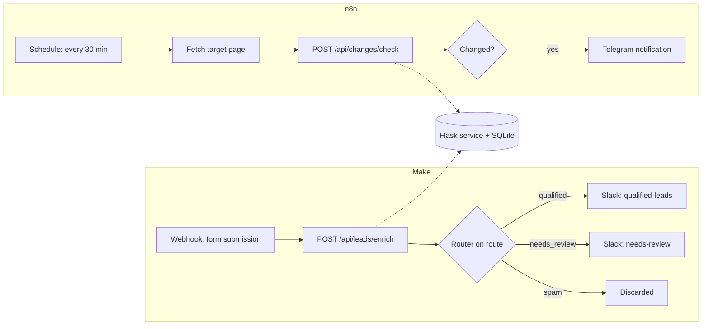

# Architecture

Two automation platforms, one shared service for the logic neither of them should own.

## Why a shared Flask service instead of doing everything in n8n or Make

Both platforms are genuinely good at scheduling, HTTP calls, and branching — that is exactly what they are doing above. What they are not a good fit for is holding state across runs ("is this different from what I saw last time?") or encoding business rules that should outlive a single node's configuration ("what actually counts as a qualified lead?"). Moving those two decisions into tested Python keeps them versioned, reviewable, and covered by the same CI as the rest of the portfolio, instead of living as an untested expression buried inside a workflow.

## Endpoints

### `POST /api/changes/check`

Request: `{"source_id": "...", "content": "..."}`
Response: `{"source_id": "...", "changed": true, "checked_at": "...", "content_length": 123}`

Hashes `content`, compares it against the last hash stored for `source_id`, and reports whether it changed since the previous check.

### `POST /api/leads/enrich`

Request: `{"name": "...", "email": "...", "message": "..."}`
Response: `{"valid_email": true, "quality_score": 100, "route": "qualified"}`

Validates the email format, scores the submission out of 100, and returns a `route` (`qualified`, `needs_review`, or `spam`) that the Make router branches on.

Both endpoints require an `X-API-Key` header matching `WEBHOOK_API_KEY`.
